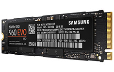

# Installing arch on Dell XPS 13 9350 

This recipe describes how to install Arch onto a Dell XPS 13 9350 machine.  It
destroys all previous installed OS's and boots Linux only, as it should be.

First get a iso that you can use to burn to a USB stick and boot the XPS. The
arch wiki's install section will have a link.

## Write iso to USB flash drive:

Be sure to use ```dmesg``` or similar to determine target drive
```
$ sudo dd if=archlinux-2017.01.01-dual.iso of=/dev/sdb1 bs=4M
```

Disable secure boot in bios, change boot sequence to boot of USB drive first.

## Boot of USB disk

Now boot of the USB stick, it will drop you into a root terminal, you will now:
- make sure you have coms, wifi or ethernet using a USB dongle.
- make some partitions, typically / and swap.
- format the partitions
- mount the / partition somwhere convenient in the live bootimage
- install arch base into / of the internet.
- chroot into the base image
- do some system setup
- reboot into your new arch system
- continue with typical userland setup like a display manger, window manager
  and apps.

## Internet

Arch installs of the internets so be sure you can get to it. I swapped out the
accursed good for fuckall broadcom card and put in a sweet intel job.

Use ```# wifi_menu``` and connect to your wifi network. Alternatively plug in
your USB ethernet adaptor you stole from your previous job.

## Make partitions



So, you are a security nut with shit to hide ? Of course you are, they have made perps of us all so
use [this guide](https://wiki.archlinux.org/index.php/dm-crypt/encrypting_an_entire_system)
to exersise the little power you assume you have left, you poor deluded 20'th
century fool.

Here is where you detroy the data on your M.2 disk and build a new Arch distro
on top of its smoking ruin. Did you know that you could take it out, store it
somewhere save, and stick a new one in, maybe even say a 1TB one. Now you do.
However, they do cost about AU$450 at the time of writing, so fuck that.


You are shooting for a layout like so:
```
Disk /dev/nvme0n1: 238.5 GiB, 256060514304 bytes, 500118192 sectors
Units: sectors of 1 * 512 = 512 bytes
Sector size (logical/physical): 512 bytes / 512 bytes
I/O size (minimum/optimal): 512 bytes / 512 bytes
Disklabel type: gpt
Disk identifier: 7681BE40-8D8B-4428-9765-14054A6FB0D3

Device            Start       End   Sectors   Size Type
/dev/nvme0n1p1     2048   1050623   1048576   512M EFI System
/dev/nvme0n1p2  1050624  16777215  15726592   7.5G Linux swap
/dev/nvme0n1p3 16777216 500117503 483340288 230.5G Linux filesystem

```

- A small EFI boot disk
- A larger swap disk, ~8G seems fine.
- The rest of the space

Some peasants like to have a ```/home``` partition, those types of people
usually do a lot of other stupid shit too, so do as you please, a single / on a
M2 based laptop is fine for me.

Use ```cfdisk``` a nice curses clownsuit for fdisk, or just use fdisk. I use
```cfdisk```, ```gparted``` is also a good choice, just get your partitions made
and be happy.


For ```cfdisk```
- Select label as ```dos```
- Use the TUI and create boot, swap and root partition using the buttons. I first make
  the boot, which is 512M, then the swap which is 2x the RAM size, and then the
  `/` partition, which is the rest of the physical disk.
- use fat for the ESP partition
- use swap type for the swap partition
- ext4 for the / partition
- make / bootable
- `write` changes and quit 

For ```gparted``` note that the partition size is specified nose tot tail, like
a train of horny Echidnas:

```
# parted /dev/nvme0n1
(parted) mklabel gpt
(parted) mkpart ESP fat32 1MiB 513MiB
(parted) set 1 boot on
(parted) mkpart primary linux-swap 513MiB 8.5GiB
(parted) mkpart primary ext4 8.5GiB 100%
(parted) quit
```

## Format partitions

The EFI boot disk is FAT 32, as you would expect from a bulshit spec from
Microsoft. Fortunately this allows the TSA and ASIO to install their shit
without destroying your pr0n. Please think of everybody elses children. The
ones whose parents get all the tax bennefits you pay for.

```
# mkfs.vfat -F32 /dev/nvme0n1p1
```

Now for swap:

```
# mkswap /dev/nvme0n1p2
# swapon /dev/nvme0n1p2
```

Here goes the pr0n:

```
# mkfs.ext4 /dev/nvme0n1p3
```


## Mount and install Arch base

The partitions are prepped and ready to go. 
Now mount the / partition and /boot partitions and install Arch base on the /
partition.

```
# mount /dev/nvme0n1p3 /mnt/
# mkdir -p /mnt/boot
# mount /dev/nvme0n1p1 /mnt/boot
# pacstrap /mnt base base-devel
```

That will take a while. Enjoy some unsavory br0wsing.

## System setup

Generate the fstab file from the mounts: 
```
# genfstab /mnt >> /mnt/etc/fstab
```

Verify `/etc/fstab/` is good: ```cat /mnt/etc/fstab```.

Now chroot to the newly installed Arch system:
```
# arch-chroot /mnt /bin/bash
```

Fucking immediately install `vim` how the fuck can't that be part of the base
install ?

```
pacman -S vim
```

### Set and generate the locale

```
# vim /etc/locale.gen # en.US_UTF-8 UTF-8
# locale-gen
```

Register the locale in ```/etc/locale.conf``` : ```vim /etc/locale.conf``` And
add  ```LANG=en_US.UTF-8```

### Timezone

Find your timezone in ```/usr/share/timezone``` and link it to ```/etc/localtime```

```
# rm /etc/localtime
# ln -s /usr/share/zoneinfo/Australia/Perth /etc/localtime
```

Set system and harware clock to UTC.
```
# hwclock --systohc --utc 
```

### Hostname
Set hostname in ```/etc/hosts``` as well as ```/etc/hostname```.

### Get IP from DHCP server

```
# systemctl enable dhcpcd
```

### Boot

Now you need to enable booting the bootable partition we prepared earlier.
Grub is not working on this laptop so you will be using using systemd-boot in
UEFI mode.

Install the bootloader:
```
# bootctl --path=/boot install
```

Edi loader.conf file:
```
# vim /boot/loader/loader.conf
```

And make sure only these lines are there:

```
default arch
timeout 1 
editor 0
```

Take note of the long UUID number, and create arch.conf file:

```
# blkid -s PARTUUID -o value /dev/nvme0n1p3 >>  /boot/loader/entries/arch.conf
```

Take note of the long UUID number you just append to the end of arch.conf file and
edit the thing to look like so:

(Change the PARTUUID number with the UUID number on your machine):


```
title Lollicon Linux
linux /vmlinuz-linux
initrd /initramfs-linux.img
options root=PARTUUID=66e3f67d-f59a-4086-acdd-a6e248a3ee80 rw
```


It’s now time to update the bootloader ```# bootctl update ```

Dell XPS 13 uses PCIe for storage, you need to add the `nvme` module. Edit the
mkinitcpio configuration file:

```
vim /etc/mkinitcpio.conf
```

And add nvme in the MODULES line:

```
MODULES="nvme"
```

Now update the bootloader:

```
# mkinitcpio -p linux
```

### User
Now add a priveledged user (thys) and give it sudo rights.

```
useradd -m -G users,wheel,adm -s /bin/bash thys
passwd thys
visudo # uncomment #%wheel ALL=(ALL) ALL
```


```journalctrl -p 3 -xb ``` now shows all logs for thys

Use the nomal user for day to day things and escalate to `sudo` when needed.
Now is a good time to give the `root` user a passwd, as arch does not set one
or maybe better yet just disable it. I, however don't as it irritates the
wowsers and irritating wowsers pleases me.

# Reboot

Now exit the chroot, unmout the partitions and reboot.

```
# exit
# umount /mnt
# reboot
```

# Post Install

Install some things we know we want right now
```
# pacman -S zsh tree docker git
```

## Gnome
This machine will run i3 predominantly but Gnome is nice so install it:

```
# pacman -S gnome gnome-extra
```

As well as some other usefull things

```
# pacman -S iw wpa_supplicant dialog network-manager-applet networkmanager
```

Gnome comes with gdm, but you can use any display manager, or none at at all,
just .xinitrc, gdm is nice so I roll with that.

## Bootup
Tell systemd to start GNOME Display Manager and networking at boot time:

```
# systemctl enable NetworkManager.service
# systemctl enable gdm.service
```

## The touchpad:

Gnome handles the touhpad just fine, for 'i3' setup like below. Maybe I'll learn how 
to tell all window managers to honour this one config someday.

```
# pacman -S xf86-input-libinput
```

In ```/etc/X11/xorg.conf.d/30-touchpad.conf``` config the touchpad like so
```
Section "InputClass"
        Identifier "MyTouchpad"
        MatchIsTouchpad "on"
        Driver "libinput"
        Option "Tapping" "on"
        Option "Natural Scrolling" "on"
EndSection
```

# Misc

## Insync

Insync syncs google drive.

Install insync from the AUR
```
$ git clone https://aur.archlinux.org/insync.git
$ cd insync
$ makepkg -is
```

Add to i3 config

```
exec --no-startup-id insync start
```

Retart i3 for insync icon to appear in statsbar.


